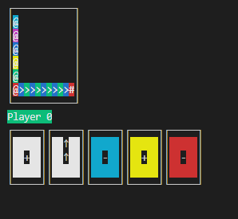

# Turtles

This is a Haskell implementation of the board game Turtles in the terminal.

## Rules
There are 6 Turtles  
Game is hardcoded for 4 players   
Every player gets 6 cards  
Player are assigned random turtle colors  
Players play one card every turn to move a turtle, and then get one card from the deck  
Whenever a turtle moves, if there's any turtle on top of it, it'll carry those with it  
First player turtle to reach the finish line wins (uppermost turtle if it's a stack)

## Card types
\+ and ↑ means moving forward  
\- means moving backwards  

DEFAULT DECK

FOR ALL COLORS  
1 COLOR ++   
5 COLOR +  
2 COLOR -  

WHITE + - MEANS WILDCARD FOR ANY COLOR  
5 WHITE +  
2 WHITE -  

WHITE ↑ ↑↑ MEANS WILDCARD FOR ANY TURTLE IN LAST PLACE  
3 WHITE ↑  
2 WHITE ↑↑  